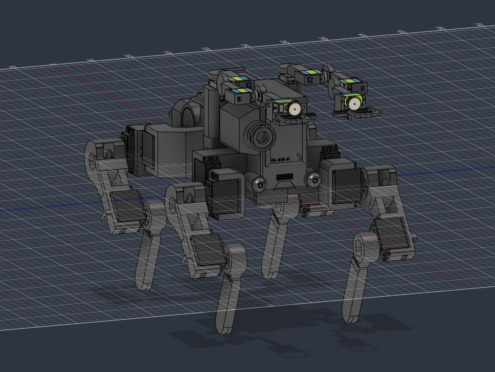

This is a 3D-printed 12-DOF quadruped robot based on the Flathead from Cyberpunk 2077, running inverse kinematics and gyroscope-based attitude control on an ESP32 S3. This project came from my love for the Cyberpunk series and the game itself, which the robot comes from. I thought it would be a fun project to spend time working on over the summer and to improve my skills. I reiterated my fixes basedd off of correcting geometry to ensure the horizontal components cancel out while the foot lands under the hip. This should let me achieve the sprawled Flathead look I am going for without paying the price in torque.

| Item | Qty | Unit Cost | Total Cost | Link | Notes |
| :--- | :---: | :--- | :--- | :--- | :--- |
| **MG996R Servos** | 3 | $18.49 | $55.47 | [Amazon Link](https://www.amazon.com/gp/product/B07MFK266B/ref=ox_sc_act_title_26?smid=A2QTZX14X1D97I&th=1) | need 1 order of 4 servos for my build but 12 mg996rs are required in total |
| **MG90 Servos** | 1 | $23.98 | $23.98 | [Amazon Link](https://www.amazon.com/gp/product/B01JY3H4MA/ref=ox_sc_act_title_1?smid=A2QTZX14X1D97I&th=1) | order 1 pack of 8 servos |
| **TPU Filament** | 1 | $23.99 | $23.99 | [Amazon Link](https://www.amazon.com/gp/product/B07VDP2S3P/ref=ox_sc_act_title_18?smid=A3M6OB6YPLO1C&psc=1) | |
| **2S 2200 mAh 7.4V LIPO** | 1 | $16.92 | $16.92 | [Amazon Link](https://www.amazon.com/gp/product/B0GS2FYJJZ/ref=ox_sc_act_title_17?smid=A1KODDOPEPALCP&psc=1) | |
| **XT60 Plug** | 1 | $8.99 | $8.99 | [Amazon Link](https://www.amazon.com/gp/product/B07QH249CR/ref=ox_sc_act_title_16?smid=A1JTH8JAMM4IYJ&psc=1) | |
| **Buck Converter for Servos** | 1 | $9.99 | $9.99 | [Amazon Link](https://www.amazon.com/gp/product/B07R832BRX/ref=ox_sc_act_title_15?smid=A323VFV6W4CN1S&th=1) | |
| **Buck Converter for ESP** | 1 | $11.69 | $11.69 | [Amazon Link](https://www.amazon.com/gp/product/B07DYXTX9H/ref=ox_sc_act_title_14?smid=A3S8HDX1Z449C4&psc=1) | |
| **4700 UF Capacitor** | 1 | $7.99 | $7.99 | [Amazon Link](https://www.amazon.com/gp/product/B0CMQ9MSR9/ref=ox_sc_act_title_13?smid=A3FX7C4A9P37IQ&th=1) | |
| **Wire Stripper** | 1 | $7.99 | $7.99 | [Amazon Link](https://www.amazon.com/gp/product/B0DYP7CFZZ/ref=ox_sc_act_title_12?smid=A2XIB5KSNI66BC&psc=1) | |
| **Heat Shrink** | Pack | $6.99 | $6.99 | [Amazon Link](https://www.amazon.com/gp/product/B0GVBMYTXY/ref=ox_sc_act_title_11?smid=AMQGUUYQT32RH&th=1) | |
| **Lipo Voltage Checker** | 1 | $6.99 | $6.99 | [Amazon Link](https://www.amazon.com/gp/product/B07VR4SV8C/ref=ox_sc_act_title_13?smid=A2ZY5CARD1LVTF&th=1) | |
| **18 Gauge Wire** | Roll | $8.89 | $8.89 | [Amazon Link](https://www.amazon.com/gp/product/B01LZRV0HV/ref=ox_sc_act_title_8?smid=AKJJC2TC2V4Y0&th=1) | |
| **14 Gauge Wire** | Roll | $10.19 | $10.19 | [Amazon Link](https://www.amazon.com/gp/product/B0DKFXHKMG/ref=ox_sc_act_title_7?smid=A1MO6ENYE5ZB9E&th=1) | |
| **ESP Dev Board** | 1 | $15.99 | $15.99 | [Amazon Link](https://www.amazon.com/gp/product/B0C7C2HQ7P/ref=ox_sc_act_title_6?th=1) | |
| **PETG Filament** | 1 | $13.22 | $13.22 | [Amazon Link](https://www.amazon.com/gp/product/B07PGYHYV8/ref=ox_sc_act_title_4?smid=A3M6OB6YPLO1C&psc=1) | |
| **Lipo Charger** | 1 | $37.99 | $37.99 | [Amazon Link](https://www.amazon.com/dp/B0G6KTKQ7F) | |
| **Raspberry Pi Zero** | 1 | $34.99 | $34.99 | [Amazon Link](https://www.amazon.com/gp/product/B0FN4CN7TM/ref=ox_sc_act_title_5?smid=A1GMZO8N77UCMQ&psc=1) | |
| **Raspberry Pi Zero Supplies**| 1 | $9.99 | $9.99 | [Amazon Link](https://www.amazon.com/gp/product/B075FLGWJL/ref=ox_sc_act_title_6?smid=A3DUZJNIM9L5CV&th=1) | |
| **Fuse** | 1 | $14.39 | $14.39 | [Amazon Link](https://www.amazon.com/dp/B07Q9PL4R6) | |
| **Pi Zero Camera** | 1 | $16.00 | $16.00 | [Amazon Link](https://www.amazon.com/dp/B07G9VLPZH) | |
| **Jumper Wires** | 1 | $6.98 | $6.98 | [Amazon Link](https://www.amazon.com/dp/B01EV70C78) | |
| **MAX98357A I2S Amplifier** | 1 | $6.88 | $6.88 | [Amazon Link](https://www.amazon.com/dp/B0DPJRLMDJ) | |
| **INMP441 I2S Microphone** | 1 | $9.99 | $9.99 | [Amazon Link](https://www.amazon.com/dp/B0972XP1YS) | |
| **4 Ohm Speaker** | 1 | $9.99 | $9.99 | [Amazon Link](https://www.amazon.com/dp/B0BTP67F81) | |
| **PCA9685 PWM Driver** | 1 | $13.99 | $13.99 | [Amazon Link](https://www.amazon.com/dp/B07BRS249H) | |
| **M3 Hardware Assortment** | 1 | $9.99 | $9.99 | [Amazon Link](https://www.amazon.com/dp/B0FGV5FCBN) | on hand |
| **MPU6050 IMU** | 1 | $11.79 | $11.79 | [Amazon Link](https://www.amazon.com/dp/B01DK83ZYQ](https://www.amazon.com/dp/B00LP25V1A/ref=twister_B078SS8NQV?_encoding=UTF8&th=1)) | on hand |
| **Metal Servo Horns** | 2 | $6.99 | $13.98 | [Amazon Link](https://www.amazon.com/dp/B09CT7QK6C) | |
| **GRAND TOTAL** | | | **$426.23** | | |
