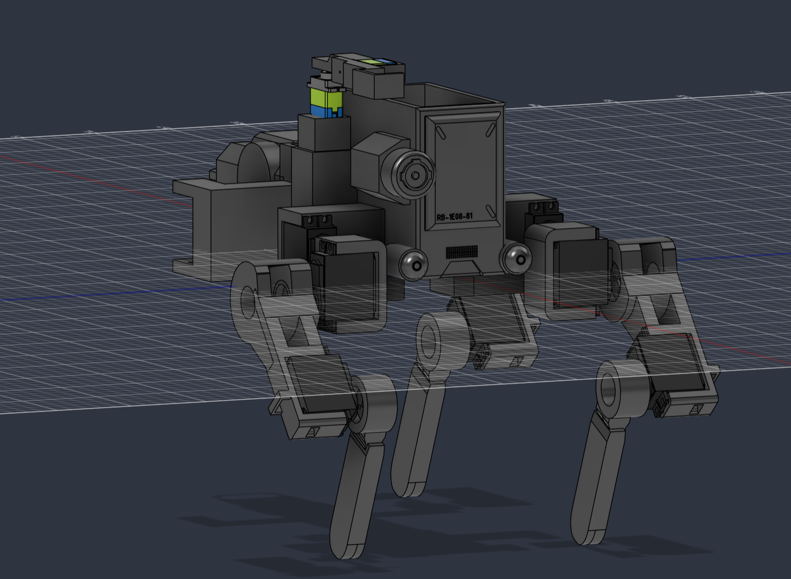
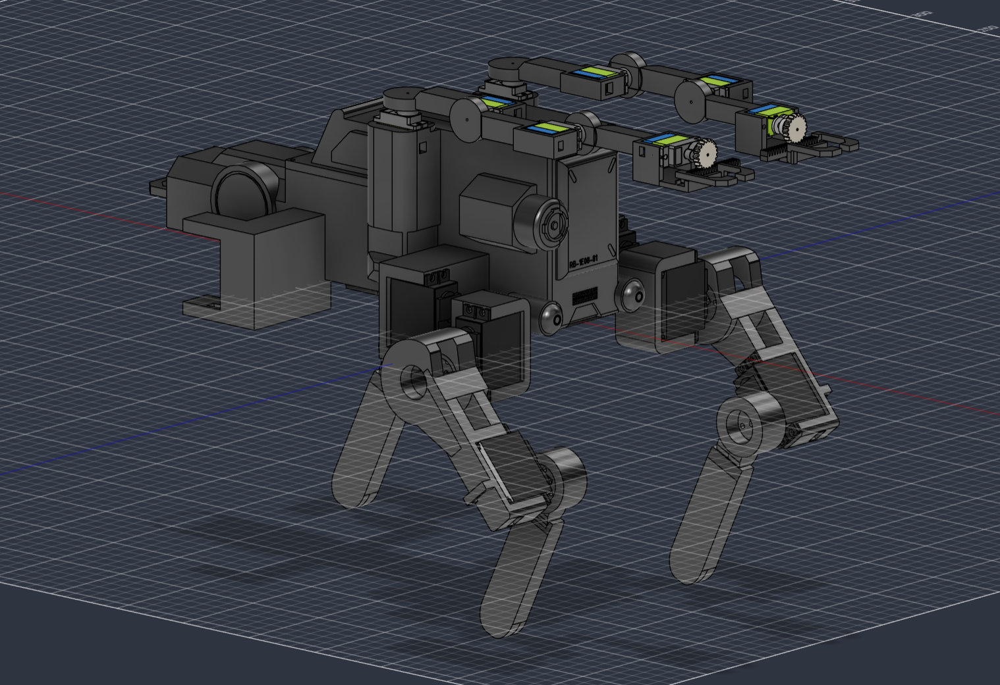
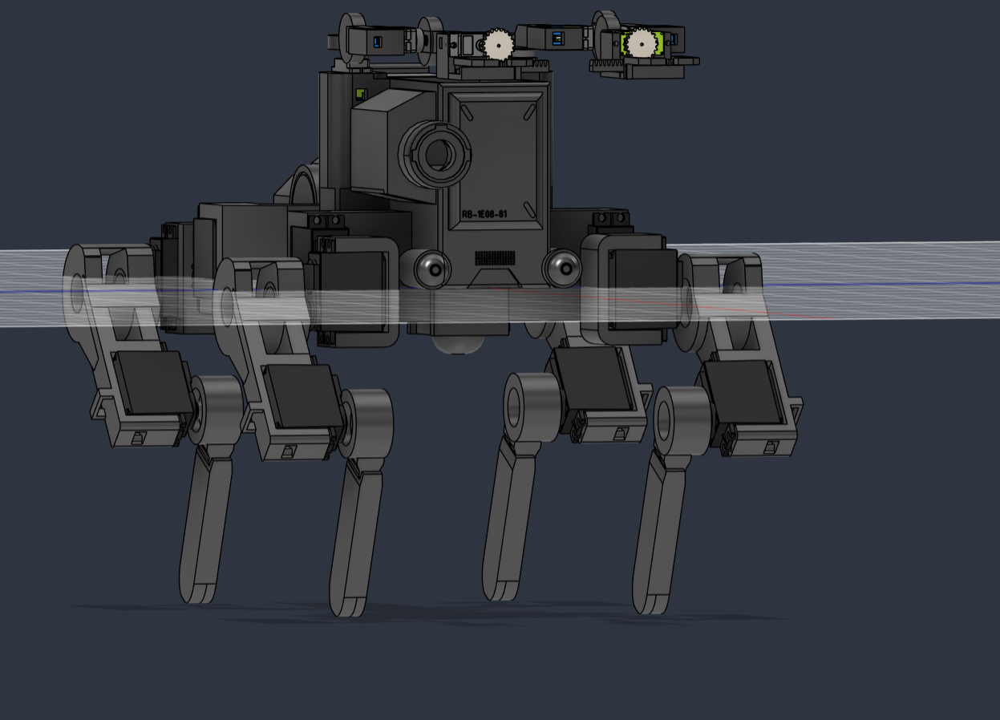
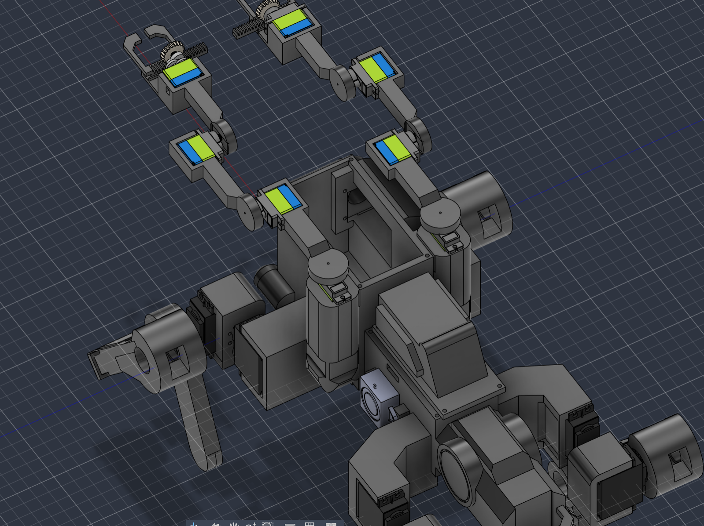

| | |
| :--- | :--- |
| **Title** | Flathead |
| **Author** | Mike |
| **Description** | A 12-DOF quadruped that walks, balances, and looks like it crawled out of Night City |
| **Created At** | 2026-08-16 |

Entry 1: 2026-08-5

The attached image is the result of my first modeling session making the flathead. I was able to construct the legs and start on the body shape and front. The legs I got inspiration for from many different leg designs which I wanted to get right as I knew it would take the most iteration. I also got started on modeling the arms although I would spend some time modeling the grabbing mechanism later.

Entry 2: 2026-8-14

Here I was able to finish the arm mechanisms and how would I keep the servos for those arms in place. I also detailed a little bit more while adding a roof that I hope will be screwed when actually putting together the build. One issue from the last modeling session I have just taken into account is the location of the camera module. I realized that were was a very good spot to actually put this in terms of looks as I believe the camera for the in game flathead is on the left side and because I already modeled it but did not make it functional, I would need to redo that area and make space for the camera itself.

Entry 3: 2026-8-15

Today I was wrapping up the cad modeling, finishing up the changes I needed for the Pi camera module. I holled out a part of the extruding feature and made an area where you can slot and screw it in. In addition to that, I added areas to put the speaker as well as the gyro module so they sit in place while adding in holes foor the wires. For the most part today was just clean up.

Details and Extra Notes:
The grippers are a rack and pinion design which I thought would be best for their simplicity and their size. 